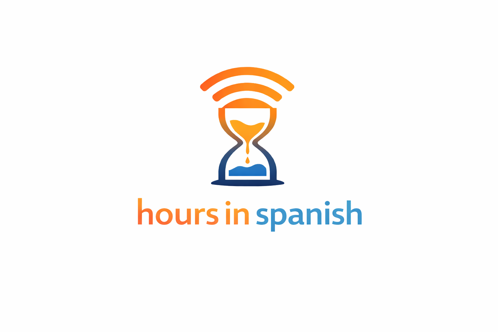

# Hours in Spanish

  

[A blog][ba] tracking my Spanish acquisition through hours of comprehensible input.

Each post documents what’s improving, what’s still difficult, and how comprehension evolves over time.

## Tech

- [Hugo][h] (static site generator) with the [mana][m] theme
- Deployed via [Cloudflare Pages][cfp]

## Local development

Run:

    hugo server -D

Then open http://localhost:1313

## Structure

- `content/hours/` → hour-based progress logs  
- `content/compartir/` → shared reflections, ideas, media and experiments  

## Status

Active project. Ongoing updates as hours accumulate.

[ba]: https://hoursinspanish.com
[h]: https://gohugo.io/
[m]: https://themes.gohugo.io/themes/hugo-mana-theme/
[cfp]: https://developers.cloudflare.com/pages/framework-guides/deploy-a-hugo-site/#deploy-with-cloudflare-pages
